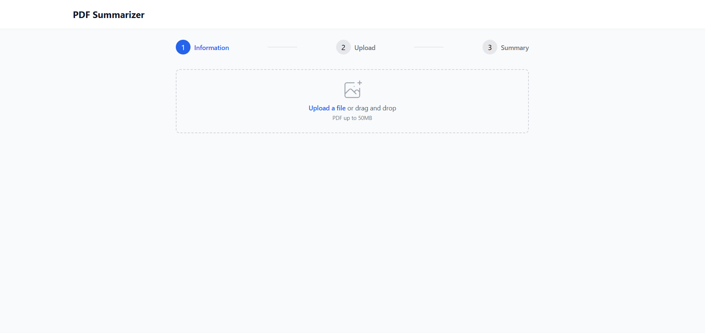

# PDF Summarizer

A modern Flask application that extracts text from PDF files and generates summaries using AI.

## Screenshots

### Upload Page

*The main upload interface with drag & drop functionality*

### Summary Page

*The summary results page showing the processed document*

## Features

- 🎯 Modern, intuitive UI with 3-step progress indicator
- 📤 Drag and drop file upload
- 📄 PDF text extraction
- 🤖 AI-powered text summarization
- ⚡ Real-time processing status
- 🔒 Secure file handling
- 📱 Responsive design using Tailwind CSS

## Technical Stack

- **Backend**: Flask
- **Frontend**: Tailwind CSS
- **PDF Processing**: PyPDF2
- **Text Summarization**: Sumy with LSA algorithm
- **File Handling**: Werkzeug

## Requirements

- Python 3.8+
- Flask
- PyPDF2
- Sumy
- NLTK
- NumPy
- SciPy

## Installation

1. Clone the repository: